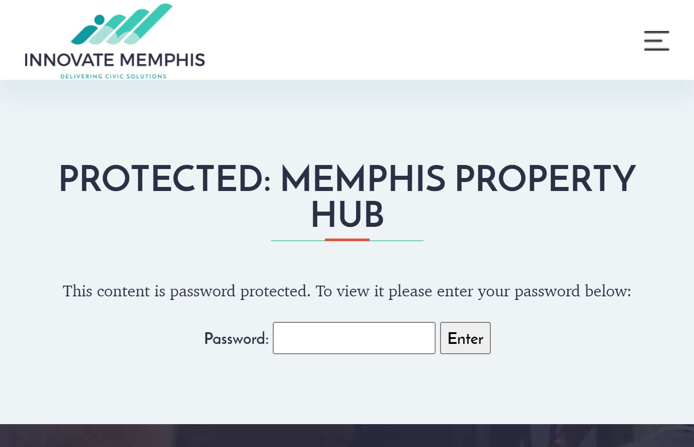

I'm reading Claire McKay Bowen's excellent book [*Protecting Your Privacy in a Data Driven World*](https://clairemckaybowen.com/book/)about balancing the data needs of policymakers with the privacy needs of those reflected in data. The book is an approachable overview of how to think about the tradeoffs between data access and privacy (And great for people without a deep background in stats `r emo::ji("man_raising_hand_light_skin_tone")`). In addition to profiling methods for protecting privacy, Dr. Bowen also explores how the federal government's approach to privacy has changed over the past century. For example, I didn't know anything about how Census workers collaborated with federal officials to identify Japanese citizens and Japanese descendants prior to internment during WWII. The Census's involvement was legal at the time but is now prohibited by federal regulation. ([More here.](https://exhibits.lib.berkeley.edu/spotlight/census/feature/japanese-americans-in-world-war-ii-and-the-census))

Throughout the book I've been thinking about past projects where I collected and analyzed neighborhood-level data, often in rural communities. These projects usually involved cleaning publicly available tax parcel data for 300-600 properties. The data was used to help local stakeholders understand trends on a street-by-street basis, often with the goal of identifying where to spend limited public resources. These datasets helped answer questions like:

-   Are out-of-town investors buying properties in this neighborhood? What types of homes do they tend to acquire?

-   Have public interventions like code enforcement, home repair programs, or streetscaping projects been effective at changing neighborhood conditions?

-   Would certain blocks be good candidates for a new affordable housing development?

We relied on tax parcel data and supplemented it with on-the-ground fieldwork that identifies building conditions, vacancy, and community assets. As these types of projects became more popular over the past few years, my team and I have started discussing how this hyperlocal data can be shared more responsibly.

### Levels of publicness

The majority of datapoints we include in these projects are from county GIS departments. `r emo::ji("map")` In that sense, our analysis doesn't disclose individual identities (like property ownership) any more than what's already provided by county tax assessment offices.

However, the truth is that while the data was technically public, in many communities (often rural) the data is presented through GIS tools that are difficult to navigate or explore. Our team at UNC School of Government would download this data, clean it, and create visualizations that show trends and relationships. In many cases, the maps we produce are the first time local government staff have seen their community visualized through tax parcel data.

In her book, Dr. Bowen describes any individual or organization intent on uncovering confidential information as "data adversaries." `r emo::ji("detective")` They could range from large corporations all the way down to individuals with malicious intent. Because of advances in computing technology, data adversaries are now well equipped to link data across hundreds of data sources to identify information about you. Publicly available tax parcel data is undoubtedly part of the arsenal for those who want to understand who owns property where. ([Think corporate rental investors.](https://www.prnewswire.com/news-releases/amherst-holdings-single-family-residential-platform-acquires-portfolio-of-1523-properties-for-1534-million-300542606.html))

But what about data adversaries that are less technically savvy than these super computing corporations? What about a predatory landlord who has never used GIS but is in the market for new properties to acquire? Or what about a local appraiser who consults all kinds of data to prescribe value to one neighborhood over another?

By transforming hyperlocal data into a more accessible format, how are we making the data more available for these local data adversaries who don't have experience using this technology? It's likely that if local government staff have never seen the data in those accessible formats, neither have other local actors.

### Community-driven data and privacy

With that in mind, how should hyperlocal data be presented? There tends to be two ends of the spectrum. On the one hand, giving local stakeholders access to all the data - maybe in an interactive dashboard - empowers them to filter, zoom in, summarize, and search through neighborhood data that might best fit their needs.

On the other hand, unrestricted access lets users develop their own stories about a neighborhood that might serve their own interests or preexisting biases. For example, a data point on the physical condition of every home in a distressed neighborhood could be used to build the case for more funding for demolition. That same dataset could also show how community assets like longtime homeowners or tenants could use public resources like home repair funds to reinvest in the community.

In her book [*Data Action: Using Data for Public Good*](https://mitpress.mit.edu/books/data-action)*,* Professor Sarah Williams writes about why data collection, analysis, and communication should be carried out hand in hand with those who will be reflected in the data.

> *"The design of data collection itself should be collaborative because including diverse actors during project planning can help create a community around a specific topic - even if all the stakeholders don't participate in the data collection itself ... Community building through data collection can even happen when governments implement the project. This was true of New York City's Department of Health and Mental Hygiene's air-quality sensing project. The project was designed to obtain feedback from the community about sensor locations; working with the community in this fashion helped residents feel integral to the project's success and helped build trust in the outputs ... By building participatory sensing projects we build communities, interest groups, and counter-narratives essential for civic change."* (page 86)

It seems like these two ideas - protections against more local data adversaries and co-collecting data with community members - go well together. By participating in data collection, analysis, and narrative development, community members are better positioned to advocate for how the data should be used or even made publicly available. They might have better knowledge about local data adversaries, whereas local governments might not be know how the data could be used maliciously if they produced it publicly on their own.

### Update: March 20, 2022

Professor Austin Harrison at Rhodes College in Memphis, Tennessee, [profiled a local community development data initiative](https://metropolitics.org/IMG/pdf/met-harrison.pdf) that links the ideas described above. Professor Harrison writes about the history of Innovate Memphis - originally a product of the Bloomberg Foundation's "Mayor's Innovation Teams" in 2012 - that developed a respository for hyperlocal data about property ownership, foreclosure, sale prices, and other vital datasets. Rather than simply hosting this data online, Innovate Memphis made the data accessible to local Community Development Corporations (CDCs) or other partners who were invested in community development initiatives.

> "From its inception, the Property Hub's key audience was CDC leaders and partners instead of government and real-estate developers. There were three reasons for this decision. First, Innovate Memphis and partners recognized that local CDCs and CBOs were at the forefront of mitigating impacts of foreclosures and abandoned properties, for which the data was aggregated and collected. Second, local data providers would only share granular information with assurance that it would be shared exclusively with nonprofits or academic partners. Third, the Property Hub quickly formed a working relationship with Memphis's for-profit real-estate data provider in order to access some hard-to-obtain data sources such as foreclosures, evictions, and sale prices. The two groups had very different audiences."

By building relationships with neighborhood leaders and the CDC community, data can be collected, analyzed, and distributed to achieve community development goals - rather than providing additional tools to local data adversaries.
